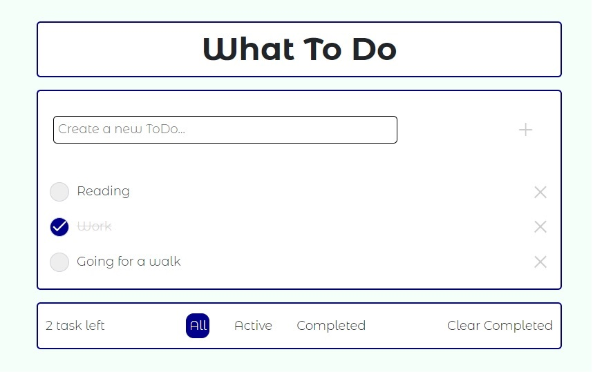

# Приложение списка дел «What To do»

## Описание: адаптивное Todo-приложение, выполненное на React, с возможностью фильтрации списка задач.

### Релизованный функционал:

- Вывод списка задач.

- Добавление новой задачи через форму.
- Отмечание задачи выполненной.

- Вывод списка зачад в зависимости от выбранного фильтра - "All", "Active", "Completed".

- Удаление задачи по клику на крестик.
- Очистка списка от выполненных задач кнопкой "Clear Completed".

### Использованные технологии:

- HTML
- SCSS
- Typescript
- React
- Jest + React Testing Library
- React-bootstrap
